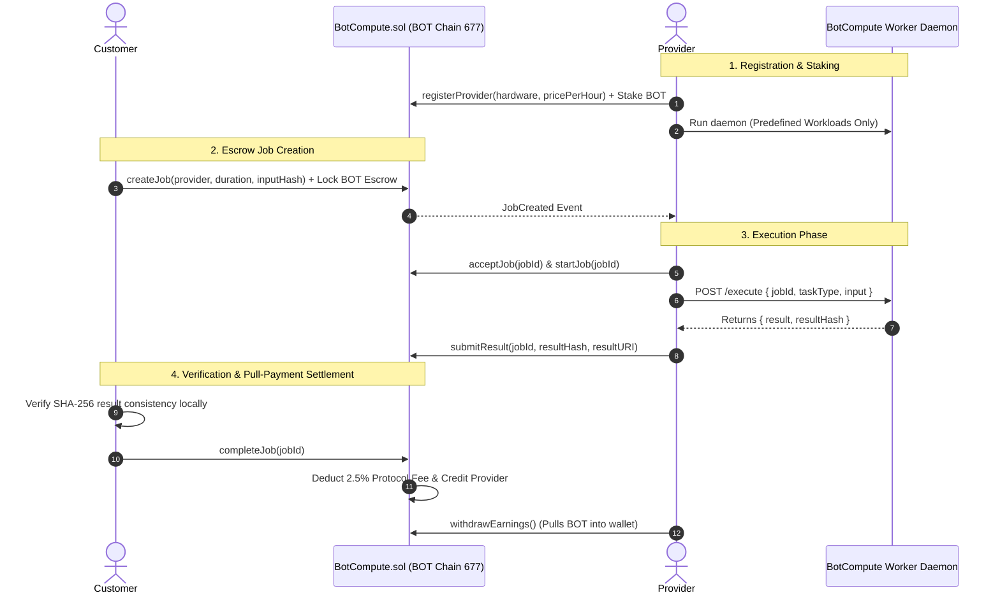

# BotCompute Protocol 🤖⚡

> *"Rent compute. Provide compute. Earn on-chain."*

**BotCompute** is a decentralized compute marketplace and escrow protocol running on **BOT Chain Mainnet (Chain ID 677, native currency BOT)**. It creates a trustless bridge between users needing computational resources (Customers) and machine operators with available hardware (Providers).

---

## 🏛️ High-Level Architecture

The protocol cleanly separates **financial escrow & state validation (on-chain)** from **workload computation & execution (off-chain)**:



---

## 🧩 Key Architectural Principles

### 1. What is On-Chain?
- **Provider Registry & Metadata**: Node name, hardware specifications, compute type (GPU/CPU/AI/Rendering), capacity units, and BOT/hour pricing.
- **Collateral Staking**: Providers stake a minimum collateral (e.g. 0.01 BOT) that remains locked while executing active workloads.
- **Non-Custodial Escrow**: Exact job duration cost is escrowed inside `BotCompute.sol`. Funds cannot be arbitrarily drained.
- **State Machine Transitions**: `Created` ➔ `Accepted` ➔ `Running` ➔ `Completed` (or `Cancelled` / `Disputed` / `Refunded`).
- **Cryptographic Result Anchoring**: Providers anchor the 32-byte SHA-256 digest of the result and an optional URI link.
- **Settlement & Pull Payments**: Upon customer approval, protocol fees (2.5%) are credited to treasury and provider earnings are credited via pull-payment accounting (`withdrawEarnings()`).
- **Arbitration Engine**: Simple MVP dispute resolution for contested jobs.

### 2. What is Off-Chain?
- **Computation Execution**: The physical hardware (CPUs, GPUs, neural accelerators) runs off-chain via the **BotCompute Worker Daemon**.
- **Workload Sandboxing**: Strictly executes safe deterministic tasks (e.g., cryptographic hashing, canonical JSON formatting, deterministic mathematics, and text processing).
- **Result Verification**: Customers can independently recompute SHA-256 digests in their browser or local environment to verify consistency before releasing funds.

> **Honesty Notice**: The blockchain **does not execute GPU/CPU code**. The blockchain guarantees financial escrow, immutable state transitions, result consistency, and dispute resolution. Cryptographic hashes verify *consistency* with recorded output, not physical hardware truthfulness.

---

## 📁 Repository Structure

```text
Work 11/
├── contracts/
│   └── BotCompute.sol         # Solidity ^0.8.24 escrow & marketplace protocol
├── test/
│   └── BotCompute.test.ts     # 24 comprehensive Hardhat unit tests
├── scripts/
│   └── deploy.ts              # BOT Chain Mainnet deployment script
├── worker/                    # Off-chain Node.js compute daemon
│   ├── src/
│   │   ├── index.ts           # Express REST API (health, info, execute, verify)
│   │   ├── executor.ts        # Sandboxed deterministic workload executor
│   │   └── types.ts           # Worker data contracts
│   ├── package.json
│   └── tsconfig.json
├── frontend/                  # Next.js 14 Web3 application
│   ├── src/
│   │   ├── app/               # App Router pages (/, /explore, /provider, /job, /dashboard, /worker)
│   │   ├── components/        # Web3 modals, cards, badges, timeline, result verifier
│   │   └── lib/               # Wagmi config, contract ABI, BotNS-ready identity
│   ├── tailwind.config.ts
│   └── package.json
├── hardhat.config.ts
├── package.json
├── .env.example
└── README.md
```

---

## 🌐 Network Details (BOT Chain Mainnet)

| Parameter | Value |
| :--- | :--- |
| **Network Name** | BOT Chain Mainnet |
| **Chain ID** | `677` |
| **Native Currency** | `BOT` (18 decimals) |
| **RPC Endpoint** | `https://rpc.botchain.ai` |
| **Block Explorer** | `https://scan.botchain.ai` |

---

## 🚀 Quickstart & Local Development

### 1. Clone & Setup Root Environment
```bash
# Clone the repository
git clone <repo-url>
cd botcompute

# Install root dependencies
npm install --legacy-peer-deps

# Copy environment variables
cp .env.example .env
```

### 2. Compile Contracts & Run Tests
```bash
# Compile Solidity contracts
npm run compile

# Run comprehensive Hardhat test suite (24 tests)
npm run test
```

### 3. Deploy to BOT Chain Mainnet (Optional)
To deploy to live BOT Chain Mainnet, ensure your `.env` contains a private key funded with BOT:
```env
PRIVATE_KEY=your_private_key_here
BOTCHAIN_RPC_URL=https://rpc.botchain.ai
```
Then run:
```bash
npm run deploy:botchain
```
*The script deploys `BotCompute.sol`, logs the contract address and BotScan explorer link, and automatically syncs the address and ABI to `frontend/src/lib/contractData.json`.*

---

## 🤖 Running the Compute Worker Daemon

The off-chain compute daemon represents a provider's compute node:

```bash
# Navigate to worker folder and start
cd worker
npm install --legacy-peer-deps
npm run dev
```
*Worker daemon starts at `http://localhost:4000`.*

### Worker API Endpoints:
- `GET /health`: Node health and uptime status.
- `GET /info`: Hardware specifications, capacity, compute type, and supported task types.
- `POST /execute`: Sandboxed execution of safe workloads (`SHA256`, `TEXT_TRANSFORM`, `JSON_PROCESS`, `DETERMINISTIC_MATH`).
- `POST /verify`: Local SHA-256 hash consistency verification.

---

## 💻 Running the Next.js Frontend

```bash
# Navigate to frontend folder and start dev server
cd frontend
npm install --legacy-peer-deps
npm run dev
```
*Frontend opens at `http://localhost:3000`.*

### Frontend Features:
1. **Landing Page (`/`)**: Real-time on-chain metrics (Active Providers, Available Compute, Jobs Completed, Provider Earnings), feature overview.
2. **Explore Marketplace (`/explore`)**: Browse providers, filter by compute category (`CPU`, `GPU`, `AI`, `RENDERING`), sort by price, capacity, or completed jobs.
3. **Provider Profile (`/provider/[address]`)**: Node hardware specifications, hourly rate, collateral stake, and direct job launch.
4. **Create Job (`/create-job/[provider]`)**: Form computing duration × rate, protocol fee breakdown, input hashing, and escrow deposit.
5. **Customer Dashboard (`/dashboard/jobs`)**: Status tracking for all escrow jobs created by the user.
6. **Job Detail (`/job/[id]`)**: Visual progress timeline, action buttons for customer/provider, and cryptographic result verification tool.
7. **Provider Portal (`/dashboard/provider`)**: Manage node parameters, toggle online/offline availability, and pull earnings.
8. **Worker Daemon Page (`/worker`)**: Local worker connectivity check, configuration instructions, and live interactive workload tester.

---

## 🛡️ Security Model & Guardrails

- **Checks-Effects-Interactions**: All state mutations precede external ether/BOT transfers.
- **ReentrancyGuard**: Applied to all payable and transfer functions (`createJob`, `withdrawStake`, `withdrawEarnings`, `cancelJob`, `resolveDispute`, `withdrawProtocolFees`).
- **Pull-Payment Pattern**: Provider earnings accumulate in `providerEarnings[address]` and are withdrawn via separate `withdrawEarnings()` transactions to avoid denial-of-service.
- **Safe Escrow Accounting**: Tracked via `totalEscrow`. Prevents double completions, double refunds, or unauthorized fund leakage.
- **No Arbitrary Command Execution**: Worker strictly executes predefined algorithms; user input never passes to shell interpreters or child processes.
- **BotNS-Ready Abstraction**: Clean identity layer (`resolveIdentity`) ready to integrate `.bot` domain name resolution without fabricating synthetic names.

---

## 🗺️ Future Roadmap

- **V2: Docker-Based Sandboxing & GPU Workers**: Containerized workloads with resource quotas (CPU/RAM limits) and NVIDIA CUDA integration.
- **V3: Decentralized Verification & Proof-of-Compute**: Multi-provider consensus verification and automated dispute settlement.
- **V4: BotNS & BotRepute Integration**: Native `.bot` naming resolution, on-chain provider reputation scoring, and automated job matching.

---

## 📜 License
MIT License. Built for the BOT Chain ecosystem.
